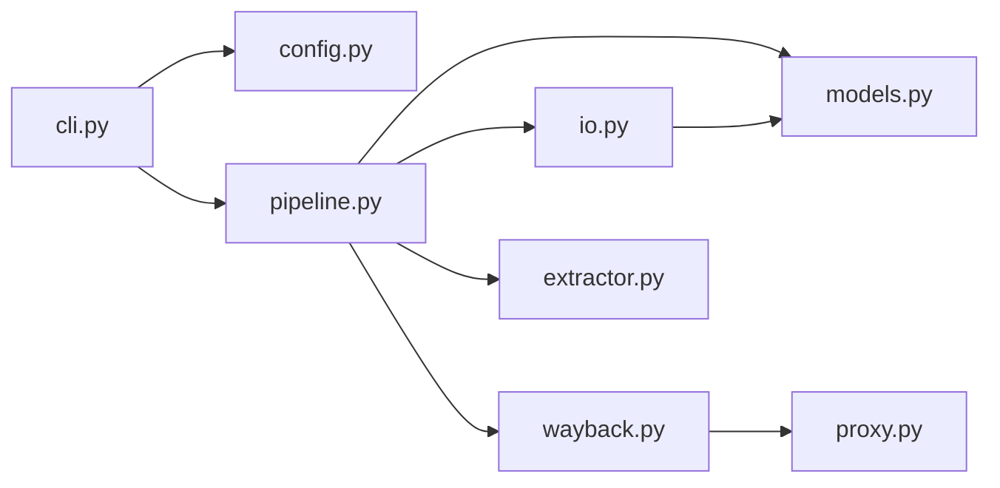

# Architecture

RSS-ArchiveORG is a small Python CLI with a layered design. Each layer has a single
responsibility; avoid mixing HTTP, parsing, and CLI concerns in one module.

## Data flow

1. **`cli.py`** parses arguments into a `RunConfig` and writes output.
2. **`pipeline.py`** orchestrates the batch: load sites, configure client, iterate.
3. **`wayback.py`** talks to archive.org (availability API + snapshot download).
4. **`proxy.py`** optionally rotates HTTP proxies on throttling or between sites.
5. **`extractor.py`** parses archived HTML and classifies social links.
6. **`models.py`** defines structured result types shared by pipeline and I/O.
7. **`io.py`** validates input URLs and serializes results.

## Module boundaries

| Module | Owns | Must not own |
| --- | --- | --- |
| `cli.py` | argparse, exit codes, stdout/stderr routing | HTTP retries, HTML parsing |
| `config.py` | Immutable run settings | Side effects |
| `pipeline.py` | Per-site workflow, logging hooks | File formats, argparse |
| `wayback.py` | archive.org HTTP client, retries, gzip decode | Social link rules |
| `proxy.py` | Proxy parsing, validation, rotation | Wayback API details |
| `extractor.py` | Social network detection | Network I/O |
| `io.py` | Read sites file, write JSON/CSV | archive.org logic |
| `models.py` | Dataclasses and serialization helpers | Business logic |

## Extension points

When adding features, prefer extending the correct layer:

- New output format → `io.py` + `RunConfig.output_format` + CLI flag.
- New archive source → new client module; keep the same `SiteResult` shape.
- New extracted field (e.g. emails) → new extractor module called from `pipeline.py`.
- New retry policy → `wayback.py` only.

## Testing strategy

- **Unit tests** per module (`tests/test_*.py`), no real network calls.
- **Fixtures** use fake HTML and mocked HTTP where needed.
- Integration tests against archive.org are optional and should be manual or marked
  `@pytest.mark.integration` if added later.
